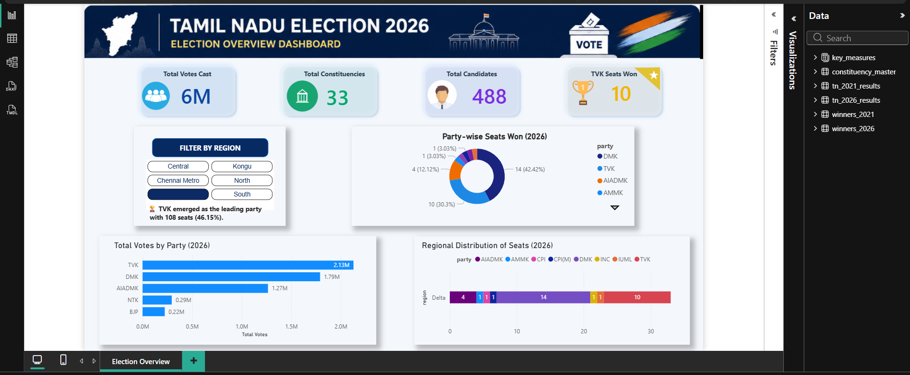

# Dashboard Preview

This folder contains the Power BI dashboard developed for the analysis of the 2026 Tamil Nadu Assembly Election.

## Dashboard Highlights

- Election overview and key statistics
- Party-wise seat distribution
- Vote share analysis
- Regional seat distribution
- Interactive region filters
- Dynamic election insights

## Tool Used

- Power BI

## File Included

- election project power bi.pbix
- dashboard-overview.png

The dashboard enables users to explore election trends and party performance through interactive visualizations.
